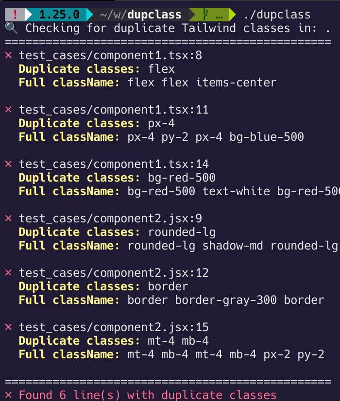

# dupclass

A fast Tailwind CSS duplicate class detector.

## Example



## Usage

```bash
# Check current directory
./dupclass

# Check src
./dupclass src

# Check specific directory
./dupclass packages/app/src
```

## Installation

```bash
make build
```

## Features

- ⚡ Fast concurrent processing with goroutines
- 🔍 Detects duplicate classes in JSX/TSX files
- 📁 Respects `.gitignore` patterns
- 🎨 Colored output with line numbers
- 🛠️ Zero external dependencies

### Supported className patterns

- `className="flex flex items-center"` (double quotes)
- `className='px-4 py-2 px-4'` (single quotes)  
- ```className={`bg-red-500 text-white bg-red-500`}``` (template literals)
- `className={cn("rounded-lg shadow-md rounded-lg")}` (function calls)
- `className={clsx('border border-gray-300 border')}` (utility functions)

## Development

```bash
# Run tests
make test

# Clean build artifacts
make clean
```
